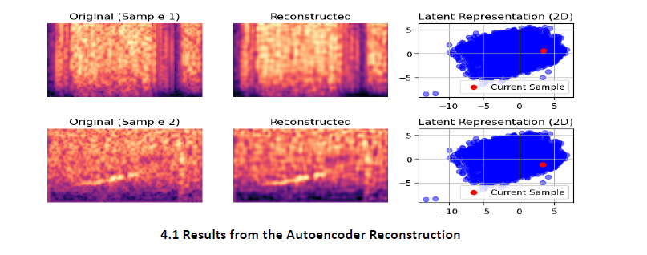
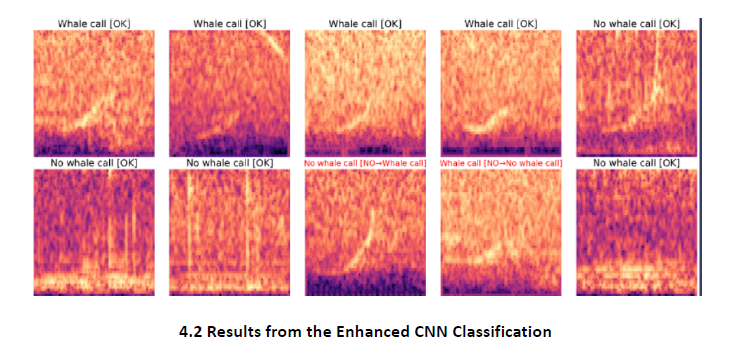

# Acoustic Detection of North Atlantic Right Whale Calls

## Folder Structure

The project directory is organized as follows:

- **Resources/**: Contains supporting files and outputs.
- `Modelling-Code.ipynb`: Notebook with modeling code for whale call detection.
- `README.md`: Project documentation file.
- `requirements.txt`: File listing Python dependencies for the project.
- `whale_data.zip`: Compressed dataset used for analysis.
- `Whale-Call-Detection-DLP-Report.pdf`: Final report detailing project methodology and results.

## Introduction
The North Atlantic right whale is one of the most critically endangered marine species, facing severe threats from ship collisions and habitat degradation. This project aims to develop a deep learning-based algorithm to detect whale calls from audio recordings. By automating whale call detection, the project contributes to marine conservation and maritime safety, addressing challenges such as:
- Background noise.
- Class imbalance in data.
- Complex whale vocalizations.

The ultimate goal is to enhance real-time alerts for ship collisions and support conservation efforts globally.

## Data Overview
The [dataset](./whale_data.zip)  comprises approximately:
- **30,000 training samples** and **54,503 testing samples**.
- Each sample is a 2-second `.aiff` sound clip recorded at 2 kHz, labeled as:
  - **1 (whale call)**: Right whale vocalization.
  - **0 (no whale call)**: Background noise or other whale sounds.

### Challenges in the Dataset
1. **Class Imbalance**: The majority of samples lack whale calls, requiring techniques like SMOTE (Synthetic Minority Over-sampling Technique) and class weighting to address imbalance.
2. **Signal Characteristics**:
   - Whale calls range from **100 to 500 Hz**, often featuring harmonics and overtones.
   - Background noise exhibits random spikes and lacks tonal features.

## Methods
### Feature Extraction
Key acoustic features extracted from audio data:
1. **Zero Crossing Rate (ZCR)**: Signal crossings through zero amplitude.
2. **Spectral Centroid**: Weighted average of frequency components.
3. **Mel-Frequency Cepstral Coefficients (MFCCs)**: Represent sound characteristics.

Features like RMS (Root Mean Square) and Spectral Bandwidth were discarded as they contributed minimally to distinguishing whale calls due to controlled recording conditions.

### Clustering
Using the refined features (ZCR and Spectral Centroid), KMeans clustering was applied post-SMOTE to balance the data and visualize patterns. However, results showed limitations in fully separating whale calls from noise due to feature overlap.

### Autoencoder
A Convolutional Autoencoder (CAE) was employed to:
- Extract hierarchical, high-level features from spectrograms.
- Reduce dimensionality for effective clustering and classification.

The autoencoder successfully compressed data into latent representations, paving the way for better separability in downstream tasks.

### Classification Models
Several models were tested:
1. **Baseline CNN**: Achieved moderate accuracy (75%) but struggled with noisy data.
2. **Enhanced CNN**:
   - Introduced batch normalization and deeper convolutional layers.
   - Incorporated numerical and image-based features.
   - Addressed class imbalance with weighted loss functions.
   - Achieved **91.73% validation accuracy** and an F1 score of **0.84**.

Other techniques like Attention-Based CNN and SincNet were explored but faced limitations in handling the low-frequency nature of whale calls and short audio clips.

## Results
### Convolutional Autoencoder
The Convolutional Autoencoder (CAE) demonstrated effective compression and reconstruction of spectrogram data, enabling improved clustering and classification.

### **Result 1: Autoencoder Reconstruction**
The Autoencoder effectively compressed spectrograms into compact latent representations, enabling reconstruction while retaining key acoustic features. This result validated the model's ability to process and preserve essential data patterns, facilitating improved feature separability for clustering and classification tasks.

---

### Enhanced CNN
The Enhanced CNN emerged as the optimal model, achieving:
- **91.73% validation accuracy**.
- **F1 score of 0.84**, balancing precision and recall.

### **Result 2: Enhanced CNN Classification Results**
The Enhanced CNN achieved a validation accuracy of 91.73% and an F1 score of 0.84, demonstrating its robustness in handling noisy and imbalanced datasets. The model leveraged diverse features, including ZCR, Spectral Centroid, and MFCCs, alongside weighted loss functions to prioritize minority classes. Misclassifications were mitigated through batch normalization and deeper convolutional layers, ensuring high performance in complex underwater environments.

---

## Challenges and Future Work
1. **Class Imbalance**: Requires further refinement of synthetic sampling techniques to improve recall for minority classes.
2. **Noise and Feature Overlap**: Investigate advanced filtering methods to isolate whale calls more effectively.
3. **Low-Frequency Acoustic Features**: Explore multimodal approaches, incorporating environmental factors like temperature and salinity.
4. **Sequential Dependencies**: Experiment with LSTM and attention-based mechanisms for longer-duration whale calls.

## Conclusion
This project demonstrates the potential of deep learning in marine conservation by developing a reliable whale call detection system. The Enhanced CNN, with its ability to handle noisy data and integrate diverse features, provides a foundation for future advancements. Additional work on clustering different whale call structures and incorporating environmental data offers promising directions for further research.

## Citations
1. [The Marinexplore and Cornell University Whale Detection Challenge](https://www.kaggle.com/c/whale-detection-challenge/data)
2. [AI Decodes the Calls of the Wild](https://www.nature.com/immersive/d41586-024-04050-5/index.html)
3. [SMOTE for Imbalanced Classification with Python](https://machinelearningmastery.com/smote-oversampling-for-imbalanced-classification/)
4. [Convolutional Autoencoders](https://www.digitalocean.com/community/tutorials/convolutional-autoencoder)
5. [MFCC's Made Easy](https://medium.com/@tanveer9812/mfccs-made-easy-7ef383006040)
